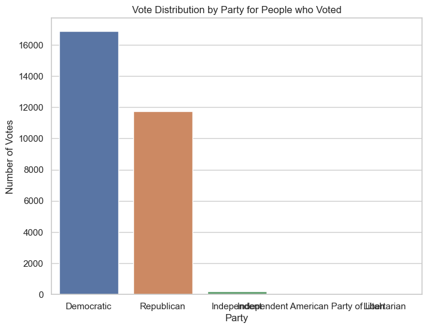

# Initial Finding
By condudcting exploratory data analysis, we see that a majority of people voted in the midterm election.

Among people who voted in the midterm election, a majority of them voted for the Democratic senate candidate

# Finding's Relevance
This finding is relevant because it gives us confidence that some people who originally would vote for Repulican switched party to vote for Democrats

# Replicate Findings
The code is running on Python 3.9.12. To install necessary packages, run 

# How to cite
